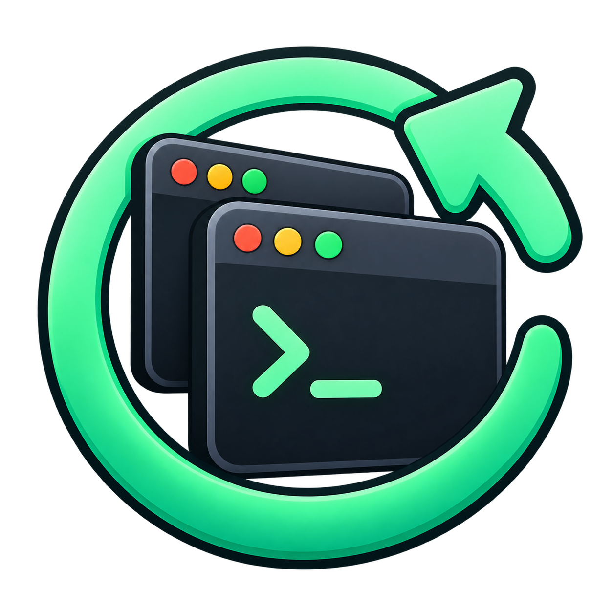

# Lazarus



A small Linux system-tray app that brings your desktop work back after reboot:
terminal commands, Claude/Codex sessions, and GUI applications.

[Project website](https://anolis.github.io/lazarus/) · [Report an issue](https://github.com/anolis/lazarus/issues)

## Run

Requires Python 3.10+, `wmctrl`, `xprop`, and an X11 desktop. The tray additionally
uses GTK 3 and PyGObject (Debian/Ubuntu: `python3-gi gir1.2-gtk-3.0`). AppIndicator
is used when available, with a legacy system-tray fallback for Cinnamon.

From this checkout:

```sh
./bin/lazarus
```

The tray saves your session every minute. On Cinnamon/GNOME it registers for
logout notifications and saves before apps close. SIGTERM also triggers a final
save; periodic snapshots provide a fallback for crashes and other desktops.
Keep Lazarus running for automatic capture. Clicking Quit stops automatic saving.

Choose **Start Lazarus at Login** to keep it running across logins. Under
**Restore at Login**, select **Previous Session**, a named profile, or
**Don't Restore**. Restore starts ten seconds after login, skipping detected
running items. Automatic saving starts after one minute.

**Save Current Session as Profile…** creates a fixed snapshot. Autosave only
updates `latest`; profiles change only when you explicitly save over them.
**Restore Session…** previews the previous session before launching it.

## Switch profiles without logging out

Choose a target under **Restore at Login**, then select **Restart into Selected
Profile…**. The preview lists the windows to close and the saved items to launch.
After you confirm, Lazarus saves a separate `recovery-…` snapshot, requests normal
window closes, and waits for the tracked processes to exit before restoring the
selected profile. **Previous Session** is pinned before the recovery save, so the
restart cannot accidentally replace its own target. **Don't Restore** requires
selecting a target first; it does not close your desktop into an empty session.

Respond to unsaved-work dialogs normally. If anything remains running after 15
seconds, the switch pauses. Close those apps (including any background instances)
and choose **Continue Restart…**, or choose **Cancel Restart**. Continue retries
normal close requests. No processes are force-killed. Terminal servers may remain
running, but their tracked shells and child processes must exit.

Automatic saves and other Lazarus restore operations pause during the switch.
Cancelling before confirmation leaves your session alone. Cancelling after some
windows close does not reopen them; the recovery snapshot remains available:

```sh
./bin/lazarus list
./bin/lazarus restore recovery-YYYYMMDD-HHMMSS-IDENTIFIER --dry-run
./bin/lazarus restore recovery-YYYYMMDD-HHMMSS-IDENTIFIER
```

On a failed, interrupted, or partially cancelled restart, autosave stays paused
to preserve recovery information, including after Lazarus starts again. Use
**Save Session** when your desktop is ready to resume automatic saving. Saved
recovery and pinned-target snapshots remain until you remove them yourself.

Restart closes only the tracked windows shown in its preview. Autostart apps,
unrecognized terminals, and newly opened apps are outside that scope. It is a
workspace switch, not a replacement for a desktop logout. Recovery snapshots
contain launch instructions, not unsaved document contents or process memory.

## CLI

```sh
./bin/lazarus doctor
./bin/lazarus save
./bin/lazarus list
./bin/lazarus show latest
./bin/lazarus restore --dry-run
./bin/lazarus restore --only 1 3
./bin/lazarus profile save work
./bin/lazarus profile select work
./bin/lazarus profile previous
./bin/lazarus profile off
./bin/lazarus autostart enable
./bin/lazarus autostart disable
```

`save NAME` and `restore NAME` also support named snapshots. `restore --force`
bypasses duplicate detection. For an installed CLI, `pip install .` provides
`lazarus`; use a Python environment with system GTK bindings for the tray.

Snapshots and preferences live in `$XDG_STATE_HOME/lazarus` (default
`~/.local/state/lazarus`). Snapshots are JSON written atomically with mode 0600.
Launcher output goes to `restore.log` there. Treat snapshots as executable
configuration: review files received from others before restoring them.

If a restore launcher fails, automatic saving pauses to preserve the saved
session. Use **Save Session** after resolving the failure to resume saving.

## Current scope

- Kitty and GNOME Terminal, preserving the emulator, shell, cwd, and foreground
  argv. Shell startup files load before resumed commands.
- Claude named resumes and explicit Codex resume IDs are preserved. Other AI
  sessions use latest-in-directory; multiple sessions in the same directory
  cannot yet be pinned reliably.
- Desktop launchers, Flatpak, moved AppImages, Firefox, Nemo, and VLC are
  recognized using the prototype's rules. Firefox's own session restore must
  be enabled to recover tabs. Nemo folder detection is based on window titles.
- Terminal dedupe matches cwd and resume command, accounting for multiplicity.
  App dedupe uses WM_CLASS. It is conservative about existing app windows;
  workspace/geometry, browser-tab-level and multi-window restoration are pending.
- A launch success means the process started, not that its application session
  fully recovered. Very slow window creation can defeat immediate repeat-restore
  deduplication. Check `restore.log` for application errors.
- Automatic saving requires the tray process. Logout hooks and reboot recovery
  need a real logout/reboot test on your desktop; SIGKILL/power loss can lose up
  to a minute of changes. Wayland is not supported yet.

The original scripts remain in `prototype/`; background restore does not execute
their generated shell scripts. Restored processes have Claude/Codex session
environment variables removed.

## Development

```sh
python3 -m unittest discover -s tests -v
```
